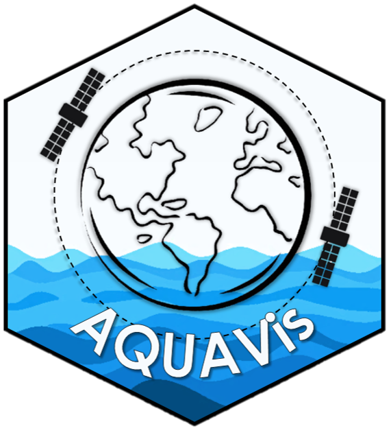

# AQUAVis (Aquatic Virtual Constellation for Landsat-Sentinel Rrs Observations) 



AQUAVis is a robust and systematic pipeline designed to harmonize OLI (Operational Land Imager) and MSI (Multispectral Instrument) data for aquatic remote sensing applications. By integrating key processing techniques, AQUAVis ensures consistency and accuracy in multi-sensor observations, enhancing the reliability of aquatic environmental monitoring. AQUAVis provides a comprehensive solution for researchers and practitioners working in aquatic remote sensing, facilitating improved data fusion and analysis across different satellite platforms. By standardizing processing techniques, AQUAVis supports more accurate and reliable environmental assessments in inland and coastal waters.


## Product description
The final AQUAVis product follows a structured naming convention:
```
AQUAVis_T<sentinel_tile_name>YYYYMMDDTHHMMSS<product_specification>_<band>_v1.0
```
Where:
- **<sentinel_tile_name>** corresponds to the MGRS tile, following the Sentinel-2 A/B naming convention.

- **YYYYMMDDTHHMMSS** represents the date and time of image acquisition. When multiple overlapping Landsat-8/9 and Sentinel-2 scenes are acquired on the same day, the acquisition hour-time is used to distinguish them.

- **<product_specification>** is defined as either L30 or S30. L30 products are derived from Landsat-8/9 data, resampled, and gridded to match the reference images and MGRS grid used for S30. S30 products originate from Sentinel-2A/B imagery, resampled to 30 m spatial resolution, and spectrally adjusted to align with the OLI spectral bands.

- **<band>** represents the spectral band, following the band name and central wavelength of the OLI Relative Spectral Response (RSR): B2 (Blue, 483 nm), B3 (Green, 561 nm), B4 (Red, 655), B5 (NIR, 865 nm). 

## Dependencies management and package installation

To run this package, you need to install the required dependencies. An `environment.yml` file is provided in the repository for easy setup. Follow the steps below to set up your environment.
```
bash
git clone https://github.com/thaimunhoz/aquavis.git
conda env create -f aquavis_env.yml
conda activate aquavis_env
```

## Usage

The package requires specific input parameters to run. Below is a list of required parameters and their descriptions. An example of how to use the package is provided in the usage_example folder.

**Input Parameters**

  *- input_satelite*: Specify the satellite (e.g., "landsat" or "sentinel").

  *- tile*: The tile ID corresponding to the region of interest.

  *- initial_date*: The starting date for analysis (format: YYYYMMDD).

  *- end_date*: The ending date for analysis (format: YYYYMMDD).

  *- output_directory*: Directory where the processed outputs will be saved.
