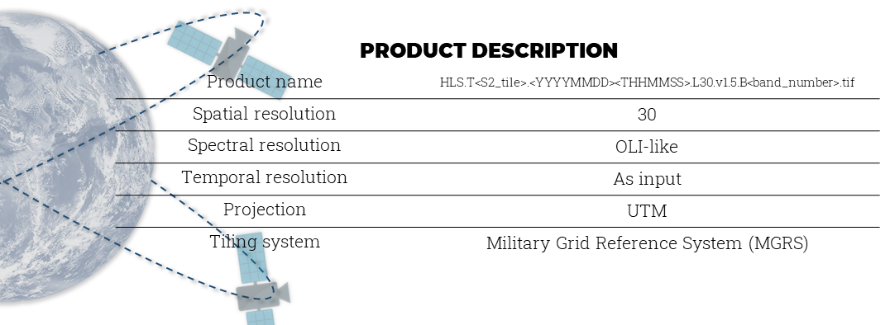

# HLS for Aquatic Environments

This repository provides tools and workflows for analyzing Harmonized Landsat and Sentinel (HLS) data in aquatic environments. The package is designed to facilitate processing and analysis of satellite imagery, specifically tailored for water quality and aquatic research.



## Dependencies management and package installation

To run this package, you need to install the required dependencies. An `environment.yml` file is provided in the repository for easy setup. Follow the steps below to set up your environment.
```
bash
git clone https://github.com/yourusername/hls-aquatic-environments.git
cd hls-aquatic-environments
conda env create -f environment.yml
conda activate hls-env
```

## Usage

The package requires specific input parameters to run. Below is a list of required parameters and their descriptions. An example of how to use the package is provided in the usage_example folder.

**Input Parameters**

  *- input_satelite*: Specify the satellite (e.g., "landsat" or "sentinel").

  *- tile*: The tile ID corresponding to the region of interest.

  *- initial_date*: The starting date for analysis (format: YYYYMMDD).

  *- end_date*: The ending date for analysis (format: YYYYMMDD).

  *- output_directory*: Directory where the processed outputs will be saved.
